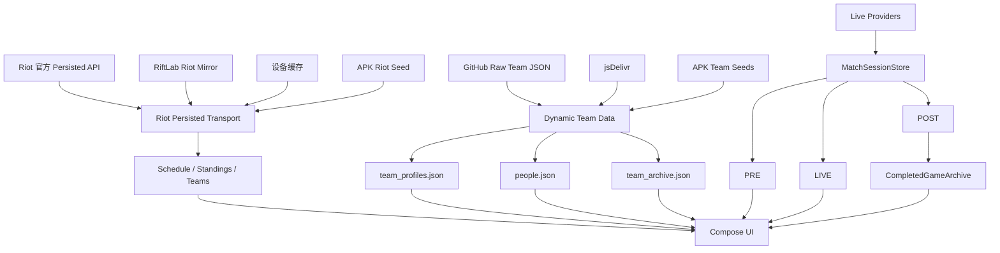
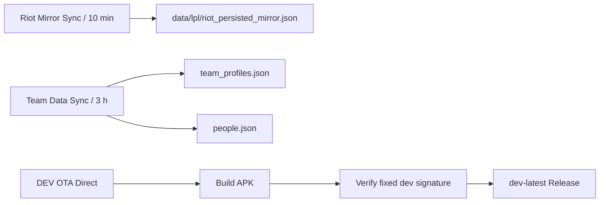

# RiftLab 开发履历：从观赛浮窗 MVP 到电竞战队档案平台

> 文档快照：`1.0.0-dev.30`  
> 开发记录范围：2026-09-08 ～ 2026-09-09 及此前产品构想  
> 仓库：`xbu080675-creator/Rlftlab`

这不是一份单纯的版本更新日志，而是一份产品与工程回忆录。它记录 RiftLab 为什么会从一个英雄联盟观赛浮窗 MVP，快速演化成同时包含赛事中心、实时比赛状态、赛后详情、战队档案、动态人物资料和自动更新体系的电竞数据应用；也记录我们走过的弯路、推翻过的假设，以及这些问题最终怎样反过来塑造了现在的架构。

---

## 1. RiftLab 最初想解决什么

RiftLab 的出发点不是“再做一个比分 App”。从一开始，它的目标就是围绕真实观赛过程建立一个辅助数据层：直播仍然由官方或平台负责，RiftLab 不托管直播流，而是在直播之外补充观众真正需要的赛前、赛中和赛后信息。

最初的产品骨架被固定为三段：

- **PRE / 赛前**：赛程、首发、Rank、转会、阵容与比赛前信息；
- **LIVE / 赛中**：实时比分、当前小局、数据状态、未来的 RiftScreen 副屏；
- **POST / 赛后**：比分、比赛详情、选手数据、MVP/POG，以及未来完整的复盘能力。

随着开发推进，一个更大的事实逐渐明确：电竞赛事并不是“比赛 ID + 两个队 + 最终比分”这么简单。赛事有节目开始与游戏开始的区别，有局间，有积分与年度积分的区别，有战队品牌与运营主体的区别，有经理、赛训总监、领队同时存在的组织结构，也有战队收购、改名、席位继承和多次复职的人物履历。

RiftLab 后来的大部分架构调整，都是为了把这些真实世界语义正确表达出来。

---

## 2. 一直没有放弃的开发原则

### 2.1 不用假数据填满页面

如果没有可靠来源，宁愿显示“暂无可靠记录”，也不为了视觉完整去伪造选手、管理人员、荣誉、赛果或历史关系。

### 2.2 “赛事开始”不等于“游戏进入”

官方直播开始后可能还有评论席、选手入场、赛前短片和 BP 准备。只有真正拿到小局实时数据，才能表示当前游戏已经 LIVE。

### 2.3 数据概念必须分清

例如：

- 组内/联赛排名积分 ≠ 年度 Championship Points；
- 创始人 ≠ 现任负责人；
- 股东/品牌方 ≠ 实际运营方；
- 负责人 ≠ 法定代表人；
- 新出现一个“经理” ≠ 旧经理自动离任；
- 俱乐部成立时间 ≠ 当前品牌成立时间 ≠ 英雄联盟分部谱系起点。

### 2.4 现任人员不能靠推理“离任”

这是后来被明确写进数据治理规则的一条硬约束：**没有明确离任证据，就不能把现任管理人员移除或转入历史档案。**

### 2.5 运行时不能押注单一公共数据源

任何一个外部 API、CDN、Wiki 或赛事接口都有可能在移动网络、地区网络或限流策略下失效。关键页面必须有降级链，而不是一处网络错误就把赛程、排名、战队页面一起打空。

---

## 3. 第一阶段：从 Android Overlay MVP 开始

仓库最早的重要节点是：

- `a971addb7373474837e86eb6011761e64c763ac2` — `feat: build RiftLab Android overlay MVP`

最初版本先证明最核心的产品形态能够在 Android 上跑起来：以电竞风格 UI 承载比赛数据，并朝“主屏看直播、副屏/浮层看数据”的方向发展。

很快我们发现，单纯把某个 API 返回的状态直接显示出来不够。比赛是有生命周期的，因此早期连续出现了一批围绕状态隔离的提交：

- `249423cb31426726c668d5758fcfa4cf6c5c4c66` — `feat: isolate current LPL game from completed games`
- `3159cfb0bc11edca89998111cbac55cd0c3899c0` — `refactor: route LPL live through current-game-only provider`
- `c58cd0b6e9114574fa03e2ee25f649c44e31e8d1` — `feat: separate live current game from completed post-game state`
- `5a133bc9667ed0bd92ee6dbbaafb1c4c7245dd8c` — `feat: archive finished game snapshots for post-match`

这批改动奠定了后来 PRE / LIVE / POST 的基础：当前直播状态不能被刚刚结束的上一小局污染，赛后数据也不能因为下一局开始而丢失。

### 这一阶段学到的第一件事

**“当前比赛状态”与“历史比赛结果”必须是两个数据对象。**

这看起来很基础，但它决定了后面完整比赛详情、局间状态和时间轴系统是否有可能继续发展。

---

## 4. 第二阶段：赛事中心开始成形

随后 RiftLab 从单场观赛辅助扩展成完整赛事中心。产品不再只关心“正在打谁”，而是开始处理：

- 赛程；
- 赛事与赛季；
- 排名；
- 淘汰赛；
- 战队；
- 比赛详情；
- 赛后数据。

这一阶段有一个非常具体的用户体验问题：赛事不能按接口原始顺序堆在页面里，否则用户要滑十几秒才能找到想看的赛季。于是赛事目录开始按全球总决赛、赛季、赛段和时间进行更符合电竞观众习惯的组织。

同时，比赛详情从只有简化比分逐步走向能够跳转到更完整的比赛实体。战队 Logo、统一战队身份解析也在这一阶段不断修复。比如：

- `869813d0a1a415292012d8019ab169b518c141f2` — `fix: resolve team logo in team detail state`
- `307693fa033b41f57397f89ca768ae36745ce153` — `fix: render resolved team logo in team pages`
- `6e15647e80da0987edfc6a6444ae322dfdc9fcf6` — `release: bump dev.13`

早期 dev.1～dev.20 的部分版本提交非常密集，而且不是每一版都有完整独立 changelog，因此这份文档不伪造逐版对应关系，而是按已经能够从提交历史确认的开发阶段记录。

---

## 5. 第三阶段：战队不再只是一个 Logo

战队页面最初主要来自 Riot roster，但很快就暴露出一个问题：电竞战队的真实信息远比“5 个首发”复杂。

围绕首发、替补、教练组的关键提交包括：

- `017ed507f50f629a93b2f82b06fe466677f4bf8b` — `feat: preserve substitutes and derive latest starters`
- `55b7582034bbfc249ea1aeee8fa8c09b3e9f49bb` — `feat: resolve starters substitutes and coaching staff`
- `1d8215c9d73c000a4017342f9be6bf18714c6172` — `feat: show starters substitutes and coaching staff`

从这里开始，战队实体至少需要区分：

- 当前首发；
- 现役替补；
- 主教练；
- 教练；
- 助理教练；
- 分析师；
- 管理人员。

而这还只是后来 Team Archive 的起点。

---

# 6. dev.21 ～ dev.30：数据架构真正成型

从 dev.21 开始，版本语义和问题链条已经比较完整，可以逐版回顾。

## dev.21 — 移除不稳定的运行时 Wiki 依赖

### 问题

战队教练与管理层曾尝试在手机端直接访问 Leaguepedia/Fandom。实际测试发现：

- Android 移动网络可能连不上；
- Leaguepedia Cargo 匿名访问存在限流；
- GitHub Actions 探针也出现连续 `ratelimited`；
- 一个资料源失效会让整块战队资料消失。

相关提交：

- `7012d1f33a4d613a968d38b21557be515e7e97dc` — `refactor: use cached staff data without runtime wiki parser`
- `f20d7d0407259fae3aec555a7da31c9a57f8da66` — `refactor: remove runtime Liquipedia scraper`
- `852da392a049bd2e7852c109dfc23478cffb9713` — `fix: avoid duplicate management and coaching records`
- `c443c8398b6136a30bf60569d92e56664cbd722e` — `docs: describe dev21 profile source fix`

### 决策

第三方 Wiki 可以作为补充研究源，但不能成为生产 App 的强运行时依赖。现任管理层改成可控的离线/自有数据快照，可靠性优先。

---

## dev.22 — “赛事进行中”与“小局直播”正式拆开

### 问题

Riot Schedule 的 `inProgress` 只说明赛事节目已经进行，不代表召唤师峡谷里的游戏已经开始。

### 实现

引入更细的赛事状态语义：

- `GAME_LIVE`
- `EVENT_LIVE`
- `BETWEEN_GAMES`
- `UPCOMING`
- `COMPLETED`

只有实时 Provider 真正拿到小局帧，才显示“小局直播”。两局之间显示“局间”，评论席或选手入场阶段显示“赛事已开始 · 等待小局”。

### 意义

这是 RiftLab 第一次明确拒绝把上游粗粒度状态直接暴露给用户，而是按电竞实际流程重新建模。

---

## dev.23 — 排名积分与年度世界赛积分拆开

### 问题

英雄联盟赛事里“积分”至少有两层语义：

1. 当前赛事/组内的排名积分；
2. 全年用于世界赛资格的 Championship Points。

把两者混在同一个排名表里会直接误导用户。

### 实现

赛事中心新增独立“积分”页，2026 LPL 年度积分按当时已确认的赛果维护；原排名表明确使用“组内积分”概念，历史赛季也不会拿 2026 年数据冒充。

---

## dev.24 — OTA 更新 UI 第一次反过来影响发布系统

### 问题

更新说明越来越长，最终把更新弹窗按钮挤出手机屏幕。

### 实现

- 发布端只取当前版本 changelog 首段；
- 最大长度限制；
- 客户端 changelog 区域限高独立滚动；
- 下载、安装、关闭按钮固定保留。

### 同期组织语义修正

IG 的历史创始人身份不再被错误显示成当前 OWNER / 负责人。这个问题后来直接推动了“创始人、负责人、运营主体、法人不能混用”的数据治理原则。

---

## dev.25 — IG 让“战队是谁在运营”成为正式问题

通过 iG 重组信息，我们开始把战队组织关系从人物职位中拆出来：

- 当前运营体系：氧望体育；
- 重组/战略合作：虎牙直播；
- 安杰：当前董事长；
- 王思聪：历史创始人语义，不再冒充现任负责人或法人。

到这里我们明确决定：RiftLab 是电竞产品，不做工商信息平台。社会信用代码、注册资本等信息不需要出现在战队页；真正应该表达的是**谁在运营这支电竞战队、谁负责赛训和管理**。

---

## dev.26 — Dynamic Team Data：APK 不再等于数据库

### 问题

管理层和教练会变化。如果每次人员变动都必须重新发 APK，数据维护成本完全不可接受。

### 实现

新增：

- `data/lpl/team_profiles.json`
- `DynamicTeamDataProvider.kt`
- 每 3 小时执行的 Team Data Sync
- GitHub Raw / CDN 远程读取
- App 缓存
- Kotlin 离线快照兜底

相关提交：

- `08b8162a6c211b8dbc545e756623268dc64ef2ee` — `feat: add remote LPL team directory dataset`
- `039a5f85f21f73c33dd6a11cc16127f0dfcccf4c` — `feat: add remote-first dynamic team data provider`
- `e5c09190d29e0239c9aba494b13762f6b86e8423` — `feat: wire team detail to dynamic remote directory`
- `908ccfc6096060fc900bfa2ee30d7c9a21d7d0a5` — `fix: keep data sources separate from official social links`

### 数据治理

自动同步只能在高置信官方措辞下修改现任数据；模糊结果只能进入 watch state，不能直接污染战队资料。

---

## dev.27 — 运营主体 + 历史荣誉 + “不能推测离任”

这一版解决了三个重要问题。

### 1. 工商信息退出产品主线

产品只关心电竞语义下的运营主体、负责人和组织关系，不继续扩展法人、社会信用代码等工商字段。

### 2. 离任管理人员不能直接消失

加入 `RIFT LEGACY / 历史荣誉`。管理负责人确认离任后，可从 current 迁移到 history，并保留曾任职务和来源。

“RiftLab 荣誉成员”只是 RiftLab 档案层称号，不冒充俱乐部官方授予的名誉职位。

### 3. BLG 袁玺 / You 暴露了“一个职位只能一个人”的错误假设

袁玺被确认存在“赛训总监 / 经理”双重公开身份；You 在第二赛段已有经理记录，同时没有明确离任证据。

最终规则被固定：

> 新出现一位经理，并不能证明另一位经理已经离任。电竞俱乐部可以同时存在经理、赛训经理、赛训总监、分部经理等重叠职位。只有明确离任证据才能移除现任记录。

---

## dev.28 — 人从战队 JSON 里“独立出来”

### 问题

一个人可能：

- 在不同战队任职；
- 离开后再次回归；
- 同时拥有不同公开角色；
- 头像与人物本身绑定，而不应和某一支战队记录绑定。

### 实现

新增 `people.json` 人物实体库，人物拥有：

- 独立 person ID；
- 姓名和别名；
- 头像引用与来源；
- 多段 employment / career history；
- current / start / end / source。

关键提交：

- `559e776123f210d13fd145d5497705628268e1f6` — `feat: add people entities avatars and career timelines`

头像策略也从“随便找一张图”升级为带来源的引用体系。优先官方定妆照、官方/认证社媒，再用可验证第三方资料补缺；加载失败时保留“管 / 教 / 誉”占位，不乱配同名路人。

这一版以后，人物履历开始具备“同一人多次效力同一战队也不能覆盖旧 stint”的能力。

---

## dev.29 — Riot Persisted Gateway 单点故障事故

### 现场问题

在真实 5G 网络下，`esports-api.lolesports.com:443` 无法连接。因为当时赛程、排名、战队 roster 和部分详情都强依赖 Riot Persisted Gateway，结果不是某个卡片报错，而是整个 App 多块页面一起空白。

### 修复

建立 Riot Persisted 降级链：

```text
Riot 官方直连
    ↓ 失败
RiftLab Riot Mirror
    ↓ 失败
设备磁盘缓存
    ↓ 失败
APK 内置 Riot 种子快照
```

Mirror 由 GitHub Actions 每 10 分钟从 Riot 官方拉取真实数据。App 明确标识 Mirror/缓存来源，不把旧快照冒充实时直连。

同时，战队详情解除对 Riot roster 的硬依赖：即使 Riot `getTeams` 不可达，动态管理层、教练组和组织资料仍可以独立显示。

关键提交包括：

- `edd23049...` — `feat: add Riot persisted mirror sync`
- `7a94b5bf...` — `ci: refresh Riot persisted mirror every 10 minutes`
- `973c6f0d...` — `feat: add resilient Riot persisted transport`
- `87da8a7a075f8a59e063b64769c1268f30b33ee9` — `fix: survive Riot persisted gateway outages`

### 这次事故留下的原则

**关键业务数据必须分层降级；一个公共接口不能再拥有“让整个产品一起消失”的权力。**

---

## dev.30 — Team Archive：战队页面重新定义

dev.30 不是“再补几个字段”，而是重新回答：**一个电竞战队页面究竟应该是什么。**

用户最终定义的核心内容是：

1. 战队建队日期；
2. 战队管理；
3. 战队选手；
4. 替补与教练；
5. 负责人；
6. 曾经离开的选手、教练、管理人员以及历史比赛；
7. 战队荣誉；
8. 战队前身及前身所属历史。

### 新增 `team_archive.json`

独立 Team Archive 模型包含：

```text
team
├─ identity
│  ├─ foundedAt
│  ├─ lolDivisionFoundedAt
│  └─ region / city / status
├─ operators
├─ parentOrganizations
├─ peopleInCharge
├─ honors
├─ lineage
└─ alumni
```

这让“品牌历史、组织历史、席位历史”可以分开表达，而不再用一句模糊的“前身：XX”概括。

例如可以区分：

- 收购并更名；
- 单纯品牌更名；
- LPL 席位继承；
- 组织层前身；
- 合并后品牌重构。

### 12 支 LPL 战队组织/谱系审计

本轮覆盖：

`AL / BLG / TES / JDG / LGD / EDG / TT / IG / LNG / NIP / WBG / WE`

对每队补建运营主体、上层组织和 lineage 框架。历史 alumni 只在有明确来源时写入；没有可靠证据的历史人员宁可保持空白，不推断离任。

### 修复 AG爱笑 / 袁玺“JSON 明明有，手机却不显示”

真正的问题不只是两个名字，而是数据分发链：

- 之前 Dynamic Team Data 首选 jsDelivr；
- CDN 可能继续返回旧版本；
- 移动网络失败后又可能回退旧 Kotlin 快照；
- 因此 main 已经修正的数据仍然可能在手机上消失。

从 dev.30 开始：

```text
GitHub Raw
    ↓
jsDelivr
    ↓
APK 内置 team_profiles.json / people.json / team_archive.json
```

最终 OTA 构建也会把上述 JSON 种子一并塞进 APK。

### dev.30 发布

最终干净版本：

- `versionName = 1.0.0-dev.30`
- `versionCode = 30`
- Release tag：`dev-latest`
- Release target：`057f5c133c6e803bb4b65a14bb2513c1381e36b0`

重要 dev.30 提交：

- `ab4a7dee508cc907c70956554de26dde415acedf` — `data(lpl): add audited team archive schema`
- `69bf9b273b47e04dea00554d999588065473f669` — `feat: add team archive provider`
- `36a006fb6f9a87252bfa60b73777e38c4122d0ab` — `feat: rebuild team pages as audited archives`
- `e18a01441f5681583e86b9cd65fd1899e9e6d72b` — `ci: bundle resilient team archive seeds in dev30`
- `057f5c133c6e803bb4b65a14bb2513c1381e36b0` — clean OTA trigger / final Release target

---

# 7. 数据架构是怎样一步步变化的

最早：

```text
外部 API → UI
```

然后变成：

```text
Riot / 第三方 API
    ↓
Repository
    ↓
UI
```

再后来加入：

```text
远程动态 JSON
    +
本地快照
    +
缓存
```

到 dev.30，已经形成多条相互独立的数据链。



后台自动化则是另一条链：



---

# 8. 数据可信度模型

RiftLab 的目标不是“抓到尽可能多的数据”，而是让每条数据知道自己为什么可信。

当前原则大致是：

1. **Riot 第一方赛事数据**：赛程、战队、比赛实体等优先；
2. **俱乐部官方公告 / 官方账号**：管理层、运营方、转会、离任等最优先；
3. **认证个人社媒**：本人身份与职位可作为重要证据；
4. **可靠电竞媒体**：用于补充、交叉验证；
5. **Leaguepedia / Liquipedia / Esports Charts 等第三方数据库**：适合发现和补缺，但不单独决定敏感的“现任/离任/负责人”结论；
6. **无法确认的内容不填。**

特别是人员变动：

```text
看到新经理出现
    ≠
旧经理已经离任
```

只有出现明确离任、合同结束、转会、卸任等可靠信息，现任记录才允许迁出 current。

---

# 9. CI / OTA 也经历了一次完整演化

RiftLab 的 OTA 并不是一开始就稳定。

我们遇到过：

- 更新说明太长导致客户端按钮消失；
- workflow_run 发布链权限问题；
- GitHub Token / App 对 workflow 文件修改权限不足；
- bot push 不会递归触发另一条普通 push workflow；
- Release 删除/重建过程可能短暂让 `dev-latest` 消失；
- dev.30 第一次发版时，tag 目标仍包含临时 workflow 变化，GitHub App 因 workflow 权限拒绝推 tag。

最后 OTA 收敛为更直接的流程：

```text
main push
  ↓
DEV OTA Direct
  ↓
Build APK
  ↓
固定 DEV 签名校验
  ↓
删除旧 APK asset
  ↓
更新 dev-latest tag / Release
  ↓
客户端检查更新
```

同时发布任务会把关键离线种子装进 APK，保证安装包不是一个“一断网就只剩壳”的客户端。

---

# 10. 走过的弯路

## 10.1 把 Leaguepedia/Fandom 当运行时数据库

失败原因：移动网络可达性和匿名限流都不稳定。结论：第三方知识库适合研究与离线同步，不适合关键页面直接依赖。

## 10.2 把 CDN 当强实时数据分发

dev.30 的 AG爱笑 / 袁玺问题证明：CDN 很适合静态资产，但人员刚修正后继续命中旧 cache 会严重误导。动态人员数据改成 Raw 优先，并加入 APK seed。

## 10.3 Riot 单点故障

dev.29 的 5G 实测说明：只要 `esports-api.lolesports.com` 连接失败，赛程、排名、战队都可能一起失效。后来才建立 Mirror + cache + seed。

## 10.4 把电竞组织职位想得太“公司化”

最开始容易默认一个战队只有一个经理、一个负责人。BLG 袁玺和 You 直接证明这种模型不成立。电竞赛训体系可以有重叠职位，数据结构必须允许多人并存。

## 10.5 把创始人、Owner、运营方和法人混在一起

IG 是最明显的反例。最终我们把产品目标收敛到电竞真正关心的运营主体与负责人，不继续扩展工商字段。

## 10.6 历史人员“删掉就算了”

这会把俱乐部历史抹掉。于是先有 `RIFT LEGACY`，再有 `people.json` 的 career timeline，最后 dev.30 把 alumni 作为 Team Archive 正式字段。

## 10.7 图片可以“找到就存”

头像也有授权和来源问题。现在更倾向保存可验证的远程引用、来源和人物实体关系，而不是批量复制第三方图片文件。

---

# 11. 截至 dev.30 的关键工程文件

## 比赛 / Riot 数据

- `app/src/main/java/com/riftlab/app/data/LolEsportsApiClient.kt`
- `app/src/main/java/com/riftlab/app/data/LolEsportsDataSources.kt`
- `app/src/main/java/com/riftlab/app/data/LolEsportsStandingsClient.kt`
- `app/src/main/java/com/riftlab/app/data/CompletedGameArchive.kt`
- `app/src/main/java/com/riftlab/app/data/LplChampionshipPoints.kt`
- `data/lpl/riot_persisted_mirror.json`

## 战队 / 人物 / 档案

- `app/src/main/java/com/riftlab/app/data/DynamicTeamDataProvider.kt`
- `app/src/main/java/com/riftlab/app/data/TeamArchiveProvider.kt`
- `app/src/main/java/com/riftlab/app/data/TeamDetailRepository.kt`
- `app/src/main/java/com/riftlab/app/ui/TeamDetailUi.kt`
- `data/lpl/team_profiles.json`
- `data/lpl/people.json`
- `data/lpl/team_archive.json`

## 自动同步 / 发布

- `tools/sync_team_data.py`
- `tools/sync_people_data.py`
- `.github/workflows/team-data-sync.yml`
- `.github/workflows/riot-mirror-sync.yml`
- `.github/workflows/ota-direct.yml`
- `DEV_CHANGELOG.txt`

---

# 12. 截至 dev.30 仍然没有完成的事情

### 12.1 历史人员不是“全量数据库”

Team Archive 已经有 alumni 模型，但历史选手、教练、管理人员仍然只允许在明确来源下加入。现在的结构完整度高于数据覆盖率，不能把“有字段”误认为“历史全补完”。

### 12.2 战队荣誉仍需要继续校验和扩充

dev.30 只先放入高置信代表性荣誉，后续应该按 Riot 官方赛事体系继续补全，并最终关联当届阵容。

### 12.3 比赛详情仍然停留在“面板”阶段

现在已经有 BP、实时/赛后比分和部分数据，但还没有真正的可拖动比赛进程。

### 12.4 战队 UI 仍然是统一 RiftLab 主题

下一阶段会开始逐队做定制视觉主题。

---

# 13. 已确定的下一阶段路线

## Phase A — 战队定制主题

每支战队单独推进，不批量套模板：

1. 指定战队；
2. 先做视觉设计图；
3. 用户验收设计；
4. 再落 Compose 实现。

工程上不会写成大量：

```kotlin
if (team == "BLG") ...
```

而会抽象成 `TeamTheme`：

```text
TeamTheme
├─ colors
├─ background
├─ cardShape
├─ typography
├─ highlight
├─ iconStyle
├─ motion
└─ decorations
```

---

## Phase B — Match Timeline / 赛事进程

目标是把当前“BP → LIVE 面板 → 最终比分”升级为可以沿时间轴复盘完整比赛。

未来的数据模型应接近 Event Sourcing：

```text
00:00 GAME_START
03:17 FIRST_BLOOD
06:42 DRAGON_KILL
08:13 PLAYER_KILL
12:26 TOWER_DESTROYED
14:03 GOLD_SNAPSHOT
18:23 DRAGON_KILL
21:46 BARON_SPAWN
...
```

并周期性保存状态快照：

- 两队经济；
- XP / 等级；
- KDA / CS；
- 装备；
- 防御塔；
- 小龙 / 大龙 / 先锋；
- 召唤师技能与关键技能状态（数据源允许时）。

用户最终可以拖到任意分钟回答：

> “17:32 当时发生了什么？”

并支持事件过滤、关键团战聚类、经济转折识别和赛后快速跳转。

---

## Phase C — RiftLab Sandtable / 战术沙盘

沙盘被确定为**赛后能力**，不是赛前玄学预测器。

它允许用户从真实比赛任意时间节点创建反事实条件，例如：

- 这波不接团会怎样；
- 不交 TP 会怎样；
- 放龙换塔会怎样；
- 某个版本改动下阵容收益如何变化。

### 核心原则：数学模型是发动机，AI 只是增强层

英雄联盟本质上是高度数字化的规则系统，因此 Sandtable 不能做成“让 LLM 猜胜率”。

规划结构：

```text
L1 数学引擎
├─ 伤害 / 双抗
├─ CD
├─ 金币 / XP
├─ 等级
├─ 装备成型
├─ 兵线
├─ 野怪与资源刷新
└─ 复活 / 时间成本

L2 模拟引擎
├─ 概率模型
├─ Monte Carlo
├─ 状态转移
├─ Player Vector
├─ Composition Vector
├─ 时间序列
└─ 因果 / Counterfactual

L3 AI 层
├─ 自然语言 → 参数
├─ 自动生成假设
├─ 战术语义理解
└─ 解释模拟结果
```

即使用户不配置任何 AI，基础数学沙盘也应该能够运行。

### AI 计算方式

未来给用户两种选择：

1. **LOCAL**：用户自己下载本地模型，由手机/本地设备承担计算；
2. **API**：用户自行配置并承担外部模型 API 费用。

RiftLab 不做代理充值、不转售 Token。API Key 应只在设备端安全保存，模型 Provider 通过统一接口接入。

### 沙盘还必须能自我回测

拿已经结束的比赛，在某个时间点隐藏未来数据，让模型推演接下来的走势，再与真实比赛比较。这样以后模型升级可以用真实误差、命中率和校准度衡量，而不是“感觉更聪明”。

---

# 14. 这 30 个开发版本真正完成了什么

从代码量看，RiftLab 只是一个 Android 项目；从产品演进看，它已经发生了几次本质变化：

```text
观赛浮窗 MVP
    ↓
赛前 / 赛中 / 赛后状态机
    ↓
赛事中心
    ↓
实时与赛后数据隔离
    ↓
战队与人物动态资料
    ↓
多源容灾数据平台
    ↓
Team Archive 电竞档案
```

真正重要的并不是版本号从 dev.1 走到了 dev.30，而是我们逐渐把那些“看起来只是 UI 小问题”的现象还原成了数据模型问题：

- 为什么赛事开始却还不能叫 LIVE；
- 为什么一个经理出现不能删掉另一个经理；
- 为什么创始人不能等于当前运营者；
- 为什么一个 API 断掉不该让整个 App 空白；
- 为什么一支战队不能只存当前 5 个人；
- 为什么 CDN 缓存也是数据正确性的一部分；
- 为什么赛后最终比分远远不够支撑真正的复盘。

这些问题共同把 RiftLab 推向了现在的方向：**不是做一个“显示电竞数据”的 App，而是构建一个能够理解赛事生命周期、战队历史、人物履历，并最终支撑比赛时间轴和数学沙盘推演的数据系统。**

这份文档记录到 `1.0.0-dev.30` 为止。后续每一个重要阶段都应该继续追加，而不是等项目再次长到无法回忆时重新考古。
